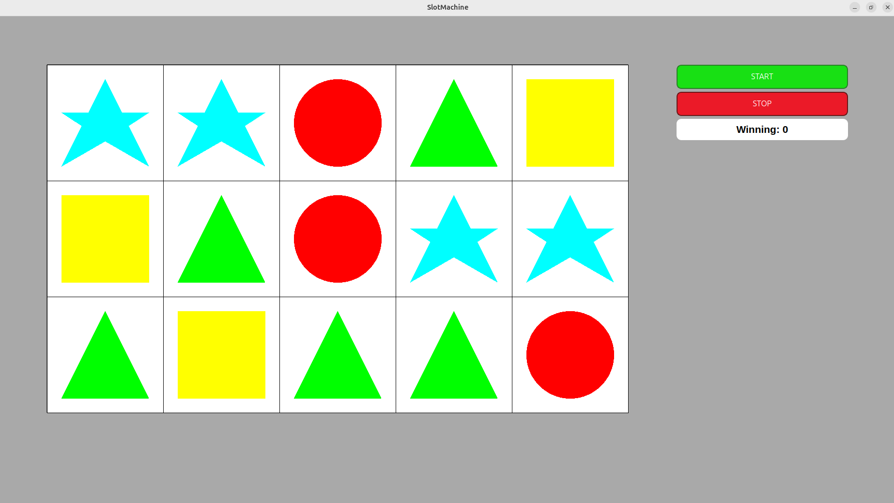
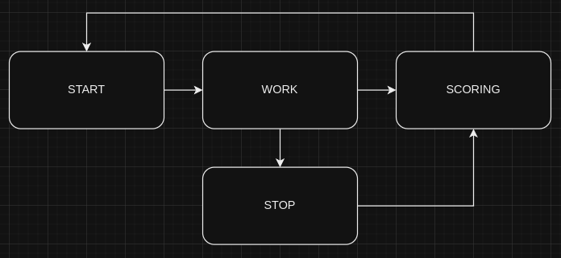

# Слот-Машина


    Это приложение эмулирует вращающиеся барабаны слот-машины. Оно включает в себя графические элементы, такие как барабаны, кнопки для запуска и остановки вращения, а также реализует автоматическую остановку барабанов и подсчет выигрыша.


## Описание

Приложение содержит следующие элементы:

1. **Барабаны слот-машины** - пять барабанов, каждый из которых имеет 12 символов.
2. **Кнопка Start** - запускает вращение барабанов.
3. **Кнопка Stop** - останавливает вращение барабанов.

### Функциональность

- Автоматическая остановка барабанов по таймеру, если кнопка Stop не была нажата.
- Плавная смена состояний барабанов.
- Остановка барабанов только в позициях, где все символы находятся на одной линии.
- Подсчет выигрыша на основе Scatter Pays. Слот-машина с "разбросанными" выигрышами (Scatter Pays). Некоторые современные слот-машины имеют механики, которые позволяют игрокам выигрывать, если они собирают определенное количество одинаковых символов, даже если они расположены не рядом друг с другом. Это называется "разбросанные выигрыши" (scatter pays). Например, если игрок соберет три или более символов в любом месте на барабанах, он может получить выигрыш.

### Машина состояний

Приложение реализует машину в которой есть 4 основных состояния:

1. **Ожидание действия игрока** - состояние ожидания нажатия на кнопку Start. [START]
2. **Вращение барабанов** -состояние, в котором барабаны вращаются. [WORK]
3. **Остановка барабанов** - состояние остановки барабанов. [STOP]
3. **Показ выигрыша** - демонстрация рассчитанного выигрыша. [SCORING]

Переходы между состояниями происходят в следующей последовательности:

- 

## Установка и сборка

### Требования

- C++ (стандарт C++11)
- Qt6
- CMake 
- Make 

### Сборка на Linux
1. Скачайте репозиторий.

#### Вариант 1: Сборка с использованием скрипта

1. Нужно перейти в дерикторию c скриптом `build.sh`.

2. Дайте права файлу `build.sh` с помощью команды:
    ```chmod +x build.sh```

3. Находясь в директории, выполните команду в терминале:
    ```./build.sh```

4. Бинарный файл будет находиться в директории build, и скопирован в дерикторию с скриптом. Для его запуска используйте команду:
    ```./SlotMachine```


#### Вариант 2: Сборка без использования скрипта

1. Перейдите в директорию с исходным кодом приложения `src`.

2. Создайте директорию для сборки: 
    ```mkdir build```

3. Перейдите в директорию build:
    ```cd build```

4. Выполните команду cmake для конфигурации проекта:
    ```cmake ..```

5. Соберите проект с помощью make:
    ```make```

6. Бинарный файл будет находиться в директории build. Для его запуска используйте команду:
    ```./SlotMachine```